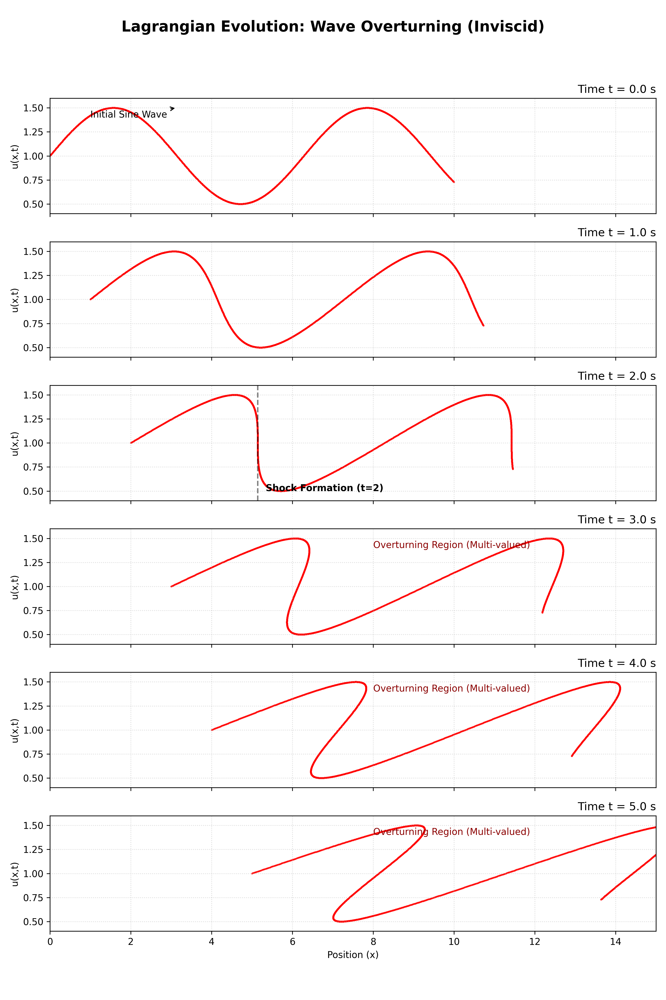
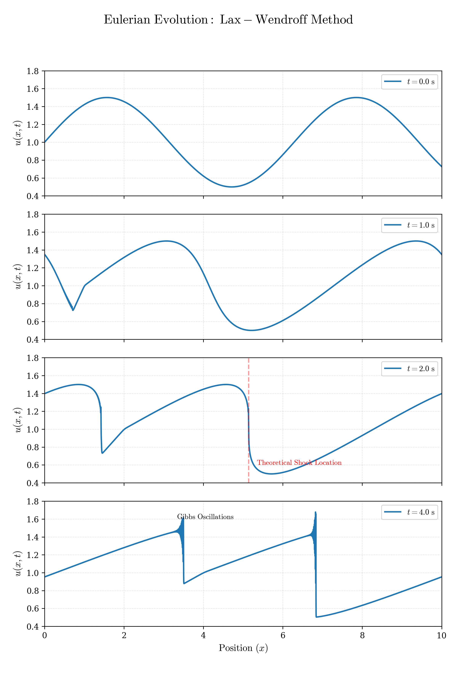

### Author: Silas Campbell

 
 
 

# Abstract

This project explores the formation and propagation of shock waves derived from Burgers' Equation (Inviscid). We start with a singularity analysis using the Method of Characteristics to calculate the theoretical shock formation time. At this time, the analytical solution to Burgers' Equation becomes multivalued. To reconcile this, we transition to weak solutions, utilizing an integral conservation form that remains valid across discontinuities. With this formulation, we derive the Rankine-Hugoniot condition to determine the velocity of the shock front. Finally, we shift to numerical methods by starting with a derivation of the Lax-Wendroff method. To finish this analysis, the Lax-Wendroff method is implemented in C++ and plotted in Python, which demonstrates how factors like numerical dissipation create a stable simulation that models how shocks propagate while respecting the physical requirements of mass and momentum conservation.

 

# Table of Contents

- [Introduction](#introduction)
- [Model PDE](#model-pde)
- [Weak Solutions](#weak-solutions)
- [Numerical Methods](#numerical-methods)
- [Results](#results)
- [Reproducibility Instructions](#reproducibility-instructions)
- [Conclusion](#conclusion)
- [References and Acknowledgements](#references-and-acknowledgements)

 

# Introduction

The inviscid Burgers' Equation serves as a fundamental partial differential equation in the study of nonlinear conservation laws and fluid dynamics. It provides a framework for analyzing how nonlinear advection without viscosity leads to the formation of a discontinuity, or shock, from smooth initial conditions.

### Motivation

The transition from smooth flow to a discontinuous shock is a critical phenomenon in real-world systems ranging from gas dynamics and acoustic waves to traffic flow modeling. By predicting the point in time and space when a shock forms, we can engineer stable systems that can withstand shock-induced stresses. 

### Methodology

Because classical analytical solutions to Burgers' Equation become multivalued after the shock formation time, we introduce weak solutions and an integral conservation form to create an equation that still operates across discontinuities. To model this, high-order numerical schemes like the Lax-Wendroff method are used to provide a link between theoretical partial differential equations and computational physics.

 

# Model PDE

We begin this analysis by considering Burgers' Equation (Inviscid):

$$u_t + u \cdot u_x = 0$$

As seen above, $u$ is multiplied by $u_x$, which makes this PDE non-linear. This term is saying that the speed at which the wave propagates is not the same for all of the particles in the wave, but dependent on the height $u$ of each particle. This intuitive understanding of the equation makes it clear how a shock wave could form. Particles in the wave with a greater value of $u$ catch up to particles with a lesser value of $u$, causing the wave to steepen until a shock forms.

### Cauchy Data

To observe this phenomenon, we define the following initial condition:

$$f(x) = 1 + \frac{1}{2}\sin(x)$$

This initial condition was chosen to provide a standard periodic wave that is strictly positive, making the wave propagate only in the positive $x$ direction.

## The Method of Characteristics

By examining the total derivative of $u$ with respect to $t$, we can constrain the trajectory of the spatial coordinate $x$ to identify the characteristic curves of Burgers' Equation:

$$\frac{du}{dt} = \frac{\partial u}{\partial t} + \frac{dx}{dt}\frac{\partial u}{\partial x}$$

We set the path $\frac{dx}{dt} = u$. By choosing the path $\frac{dx}{dt} = u$, we force the total derivative $\frac{du}{dt}$ to be equal to 0, making $u$ invariant along the characteristic curve. This reduces the PDE into a pair of ODEs.

## Solving the Characteristic Equations

The system of ODEs derived from the Method of Characteristics is:

- $\frac{du}{dt} = 0$ (the velocity ODE)
- $\frac{dx}{dt} = u$ (the path ODE)

Integrating the velocity ODE, we find that $u$ remains constant along the characteristic curve and its value is determined by its initial value at the starting position $\xi$:

$$u(x,t) = f(\xi)$$

Substituting this characteristic identity into the path ODE and integrating, we get:

$$\frac{dx}{dt} = f(\xi)$$

$$x(t) = f(\xi)t + \xi$$

From the equation above, we know $x(t)$ is linear.

## Implicit Solution

Starting with the formula $x(t) = f(\xi)t + \xi$ and subbing $f(\xi)$ for $u$, we can rearrange to solve for $\xi$:

$$x(t) = f(\xi)t + \xi$$

$$x(t) = ut + \xi$$

$$\xi = x - ut$$

Substituting this into the characteristic identity, we get the implicit solution of Burgers' Equation:

$$u(x,t) = f(\xi)$$

$$u(x,t) = f(x - ut)$$

$$u(x,t) = 1 + \frac{1}{2}\sin(x - ut)$$

Due to this being a transcendental equation, the equation cannot be simplified any further and must remain in this implicit form.

## Singularity Analysis

The implicit solution $u(x,t) = f(x - ut)$ remains valid as long as the mapping between the initial coordinate $\xi$ and the spatial coordinate $x$ is one-to-one. As soon as this mapping becomes multivalued, a singularity, or shock, forms and the spatial gradient $u_x$ becomes infinite.

To calculate the spatial gradient $u_x$, we differentiate the implicit solution of Burgers' Equation and rearrange to solve for $u_x$:

$$u(x,t) = f(x - ut)$$

$$u_x = f'(x - ut)(1-tu_x)$$

$$u_x + tf'(x - ut)u_x = f'(x - ut)$$

$$u_x = \frac{f'(x - ut)}{1 + tf'(x - ut)}$$

$$u_x = \frac{f'(\xi)}{1 + tf'(\xi)}$$

$$u_x = \frac{\frac{1}{2}\cos(\xi)}{1 + \frac{1}{2}t\cos(\xi)}$$

At time $t^* $, when $1 + \frac{1}{2}t\cos(\xi) = 0$, $u_x$ becomes infinite and a shock forms. Solving for $t^*$, we first solve for $t$ and then find the infimum of $t$:

$$t = \frac{-2}{\cos(\xi)}$$

When $\xi = \pi$, cosine is at its most negative, and $t$ is minimized:

$$t^* = \frac{-2}{\cos(\pi)}$$
$$t^* = 2$$

At $t^* = 2$, the particle starting at $\xi = \pi$ becomes the first point in the wave to become vertical, and thus $t^* = 2$ is the Shock Formation Time.

Solving for the Shock Location $x^* $, we substitute $t^* = 2$ and $\xi = \pi$ back into our path equation $x = \xi + f(\xi)t$:

$$x^* = \pi + (1 + 0.5\sin(\pi))2$$

$$x^* = \pi + 2$$

$$x^* \approx 5.14$$

The shock first appears at:

$$(x,t) = (\pi + 2, 2)$$

After $t^* = 2$, the implicit solution becomes multivalued, and weak solutions are needed to reconcile this.

 

# Weak Solutions

In Burgers' Equation, $u_t + u \cdot u_x = 0$, $u_x$ is only valid before $t^* = 2$ for our initial conditions. Because of this, the first thing we will do is put Burgers' Equation in its conservative form:

$$\frac{\partial u}{\partial t} + \frac{\partial}{\partial x}\left(\frac{1}{2} u^2\right) = 0$$

This form does not assume that $u$ is differentiable. To further elaborate why this form is needed, first we integrate where $\frac{1}{2} u^2 = F(u)$:

$$
\begin{aligned}
\int_{x_1}^{x_2} \left[ \frac{\partial u}{\partial t} + \frac{\partial}{\partial x} F(u) \right] dx &= 0 \\
\int_{x_1}^{x_2} \frac{\partial u}{\partial t} dx + \int_{x_1}^{x_2} \frac{\partial}{\partial x} F(u) dx &= 0 \\
\frac{d}{dt} \int_{x_1}^{x_2} u(x,t) dx + F(u(x_2,t)) - F(u(x_1,t)) &= 0
\end{aligned}
$$

Rearranging to isolate the rate of change, we get the integral form of this conservation law:

$$\frac{d}{dt} \int_{x_1}^{x_2} u(x,t) \, dx = F(u(x_1,t)) - F(u(x_2,t))$$

The LHS shows the rate of change of the area under the curve on the domain $[x_1,x_2]$, and the RHS shows that this change equals what flows into the left boundary, minus what flows out of the right boundary. Note that this is unaffected by the discontinuity that may be contained by the boundary values.

## Deriving the Weak Formulation

The equation previously derived is a global statement about conservation. To derive a local statement that accounts for discontinuities like shocks, we introduce a test function $v(x,t)$ with compact support, denoted $\text{supp}(v)$. This means $v(x,t)$ is a smooth, infinitely differentiable function with compact support defined on $\text{supp}(v) \subset \Omega$ where $\Omega = \mathbb{R} \times [0,\infty)$, and $v(x,t)$ is zero on the boundary $\partial \Omega$. By first multiplying the conservative form of Burgers' Equation by $v(x,t)$ and then integrating, we don't have to worry about a discontinuous increase of one of the boundary values.

$$\iint_{\Omega} \left(\frac {\partial u}{\partial t} + \frac {\partial}{\partial x}\left[\frac{1}{2} u^2\right]\right) v(x,t) \, dt \, dx = 0$$

Now we define a vector field $\mathbf{U}$ in the $(x,t)$ plane:

$$\mathbf{U} = \begin{pmatrix} \frac{1}{2}u^2 \\ u \end{pmatrix}$$

Noticing that $\nabla \cdot \mathbf{U} = \frac {\partial u}{\partial t} + \frac {\partial}{\partial x}[\frac{1}{2} u^2]$, we substitute this into our integral:

$$\iint_{\Omega} v(\nabla \cdot \mathbf{U}) \, dt \, dx = 0$$

Using the formula $\nabla \cdot (v \mathbf{U}) = v (\nabla \cdot \mathbf{U}) + \mathbf{U} \cdot \nabla v$, we rearrange and substitute this into the integral:

$$\iint_{\Omega} \nabla \cdot (v \mathbf{U}) \, dt \, dx - \iint_{\Omega} \mathbf{U} \cdot \nabla v \, dt \, dx = 0$$

By Green's Theorem,

$$\iint_{\Omega} \nabla \cdot (v \mathbf{U}) \, dt \, dx = \oint_{\partial \Omega} v \mathbf{U} \cdot \mathbf{n} \, ds$$

Where $\mathbf{n}$ is the outward unit normal vector of the boundary and $ds$ is the infinitesimal arc length. Because $v(x,t)$ has compact support and is defined to be zero on the boundary $\partial \Omega$, this line integral equals zero:

$$
\begin{aligned}

\iint_{\Omega} \nabla \cdot (v \mathbf{U}) \, dt \, dx = 0 \\

\implies \iint_{\Omega} \mathbf{U} \cdot \nabla v \, dt \, dx = 0 \\

\implies \iint_{\Omega} \left[u \frac {\partial v}{\partial t} + \frac{1}{2} u^2 \frac {\partial v}{\partial x}\right] dt \, dx = 0 \\

\end{aligned}
$$

This final equation aligns with the definition of the weak solution to Burgers' Equation in Introduction to Partial Differential Equations by Olver (2016):

Definition: A function $u(t,x)$ is said to be a weak solution to the nonlinear transport equation if:

$$\iint_{\Omega} \left( u \frac{\partial v}{\partial t} + \frac{1}{2}u^2 \frac{\partial v}{\partial x} \right) dt \, dx = 0$$

for all $C^1$ functions $v(t,x)$ with compact support such that $\text{supp } v \subset \Omega$.

By shifting the requirement of differentiability from the solution $u$ to the test function $v$, we have established a mathematical framework that remains physically consistent after the Shock Formation Time. While the weak formulation previously derived allows for the existence of shock solutions, it does not account for uniqueness. In many cases, multiple weak solutions can satisfy the same initial conditions, so to find the physically relevant weak solutions, we would add extra constraints like the entropy condition. While these concepts are crucial for a more thorough analysis of shock wave theory, they remain beyond the scope of this particular project.

## The Rankine-Hugoniot Condition

Having now derived a weak solution, we can apply this equation to determine the speed at which the shock propagates. We consider a domain $\Omega$ with a single jump discontinuity along a smooth curve $\mathbf{C}$ parameterized by $x = \sigma (t)$. This curve bisects our domain into two subdomains: $\Omega_+$ and $\Omega_-$. We define:

$$u_+ = u \mid_{\Omega_+}, \text{ which lies above } \mathbf{C}$$

$$u_- = u \mid_{\Omega_-}, \text{ which lies below } \mathbf{C}$$

$u_+$ and $u_-$ are classical solutions on their respective domains. Now we partition the weak solution integral across two sub-domains:

$$
\begin{aligned}

\iint_{\Omega_-} \left( u_- \frac{\partial v}{\partial t} + \frac{1}{2}u_-^2 \frac{\partial v}{\partial x} \right) dt \, dx \\

 + \iint_{\Omega_+} \left( u_+ \frac{\partial v}{\partial t} + \frac{1}{2}u_+^2 \frac{\partial v}{\partial x} \right) dt \, dx = 0\\

\end{aligned}
$$

Using Green's Formula:

$$
\begin{aligned}

0 = \oint_{\partial \Omega_-} (\mathbf{U_-} \cdot \mathbf{n_-}) v \, ds - \iint_{\Omega_-} \left( (u_-)_t + (u_-^2)_x \right) v \, dt \, dx \\

+ \oint_{\partial \Omega_+} (\mathbf{U_+} \cdot \mathbf{n_+}) v \, ds - \iint_{\Omega_+} \left( (u_+)_t + (u_+^2)_x \right) v \, dt \, dx \\

\end{aligned}
$$

Because $u_-$ and $u_+$ are classical solutions, $u_t + (\frac{1}{2} u^2)_x = 0$ and the integral collapses to:

$$0 = \oint_{\partial \Omega_-} (\mathbf{U_-} \cdot \mathbf{n_-}) v \, ds + \oint_{\partial \Omega_+} (\mathbf{U_+} \cdot \mathbf{n_+}) v \, ds$$

Because $v$ has compact support and equals $0$ on the outer boundary $\partial \Omega$, the only remaining part of the integral lies on the shock curve $\mathbf{C}$:

$$0 = \oint_{\mathbf{C}} (\mathbf{U_-} \cdot \mathbf{n_-} + \mathbf{U_+} \cdot \mathbf{n_+}) v \, ds$$

Since $\mathbf{n}$ represents the outward unit normal of $\mathbf{C}$, $\mathbf{n_-} = -\mathbf{n_+}$. Substituting this in, we get:

$$0 = \oint_{\mathbf{C}} (\mathbf{U_-} - \mathbf{U_+}) \cdot \mathbf{n_-} v \, ds$$

To solve for $\mathbf{n_-}$, we first parameterize the shock curve $\mathbf{C}$ as $G(x,t) = x - \sigma (t) = 0$. The gradient of $G$ will be normal to $\mathbf{C}$ and will be the value of $\mathbf{n_-}$. 

$$\nabla G = \left( \frac{\partial G}{\partial x}, \frac{\partial G}{\partial t} \right) = (1, -\dot{\sigma}(t))$$

Substituting this in and calculating the dot product:

$$0 = \oint_{\mathbf{C}} (\mathbf{U_-} - \mathbf{U_+}) \cdot (1, -\dot{\sigma}(t)) v \, ds$$
$$0 = \oint_{\mathbf{C}} \left[ \left( \frac{1}{2}u_-^2 - \frac{1}{2}u_+^2 \right) - \dot{\sigma}(t)(u_- - u_+) \right] v \, ds$$

Since this integral must equal zero for any arbitrary smooth test function $v$ with compact support, the term inside the brackets must vanish along the curve $\mathbf{C}$:

$$\left( \frac{1}{2}u_-^2 - \frac{1}{2}u_+^2 \right) - \dot{\sigma}(t)(u_- - u_+) = 0$$

We now isolate the shock speed, $s = \dot{\sigma}(t)$:

$$\dot{\sigma}(t)(u_- - u_+) = \frac{1}{2}u_-^2 - \frac{1}{2}u_+^2$$

$$s = \frac{\frac{1}{2}u_-^2 - \frac{1}{2}u_+^2}{u_- - u_+}$$

Using the difference of squares $(\frac{1}{2}(u_- - u_+)(u_- + u_+))$, the expression simplifies to the Rankine-Hugoniot condition for Burgers' Equation:

$$s = \frac{u_- + u_+}{2}$$

This result, the Rankine-Hugoniot condition, shows that the shock wave propagates at the average velocity of the state immediately ahead of and behind the discontinuity.

 

# Numerical Methods

To simulate the evolution of the wave past the shock-formation time, we implement the Lax–Wendroff scheme, a second-order accurate finite difference method for nonlinear conservation laws. We begin from the conservative form of Burgers’ Equation: $u_t + \left( \frac{1}{2}u^2 \right)_x = 0$, which can be written in general conservation form as:

$$u_t + f(u)_x = 0, \ \text{where} \ f(u) = \frac{1}{2}u^2$$

## The Lax–Wendroff Scheme for Conservation Laws

The Lax–Wendroff method is derived from a second-order Taylor expansion in time:

$$u_i^{n+1} = u_i^n + \Delta t(u_t)_i^n + \frac{\Delta t^2}{2}(u_{tt})_i^n$$

From the PDE, we can substitute the first temporal derivative:

$$u_t = -f(u)_x$$

Differentiating once more with respect to time to find the second-order term:

$$u_{tt} = -\frac{\partial}{\partial t}(f(u)_x) = -\frac{\partial}{\partial x}(f(u)_t)$$

Using the chain rule:

$$f(u)_t = f'(u)u_t$$

Substituting $u_t = -f(u)_x$ back into the expression:

$$u_{tt} = \frac{\partial}{\partial x}(f'(u)f(u)_x)$$

Thus, the Taylor expansion becomes:

$$u_i^{n+1} = u_i^n - \Delta t(f(u)_x)_i^n + \frac{\Delta t^2}{2} \left[ \frac{\partial}{\partial x}(f'(u)f(u)_x) \right]_i^n$$

For Burgers’ Equation, $f(u) = \frac{1}{2}u^2$, so the Jacobian is:

$$f'(u) = u$$

The spatial derivative of the flux is expanded using the chain rule:

$$(f(u)_x)_i^n = \frac{\partial}{\partial x} \left( \frac{1}{2} u^2 \right)_i^n = \left( u \frac{\partial u}{\partial x} \right)_i^n$$

Approximating $\frac{\partial u}{\partial x}$ with a first-order central difference, we get:

$$(f(u)_x)_i^n \approx u_i^n \left( \frac{u_{i+1}^n - u_{i-1}^n}{2\Delta x} \right)$$

For the second-order term, we approximate the nested derivative $\frac{\partial}{\partial x} [f'(u) f(u)_x]$. Substituting $f'(u) = u$ and $f(u)_x = u \frac{\partial u}{\partial x}$, the term becomes:

$$\left[\frac{\partial}{\partial x} \left(u^2 \frac{\partial u}{\partial x}\right)\right]_i^n$$

By evaluating the wave speed $u^2$ locally at grid point $i$, making $u^2$ act like a constant, we get:

$$\left[\frac{\partial}{\partial x} \left(u^2 \frac{\partial u}{\partial x}\right)\right]_i^n \approx u^2 \frac{\partial}{\partial x} \left(\frac{\partial u}{\partial x}\right)$$

Applying a second-order central difference to the second partial derivative:

$$
\begin{aligned}

\left[ \frac{\partial}{\partial x} \left(u^2 \frac{\partial u}{\partial x}\right)\right]_i^n \approx (u_i^n)^2 \left(\frac{\partial^2 u}{\partial x^2}\right) \\

\approx (u_i^n)^2 \left( \frac{u_{i+1}^n - 2u_i^n + u_{i-1}^n}{\Delta x^2} \right) \\

\end{aligned}
$$

After substitution, the formula reduces to the Lax–Wendroff method used in the code:

$$
\begin{aligned}

u_i^{n+1} = u_i^n - \frac{1}{2}\left(\frac{u_i^n \Delta t}{\Delta x}\right)(u_{i+1}^n - u_{i-1}^n) \\

+ \frac{1}{2} \left(\frac{u_i^n \Delta t}{\Delta x}\right)^2 (u_{i+1}^n - 2u_i^n + u_{i-1}^n) \\

\end{aligned}
$$

## Implementation

In the code, we define the local Courant number:

$$c_i = \frac{u_i^n \Delta t}{\Delta x}$$

Where,

$$\Delta x \approx 0.002$$

$$\Delta t = 10^{-4}$$

$$\max |u| = 1.5$$

So the CFL condition is met and $ \lvert c_i \rvert < 1$.

The final formulation used in the simulation becomes:

$$u_i^{n+1} = u_i^n - \frac{1}{2} c_i(u_{i+1}^n - u_{i-1}^n) + \frac{1}{2} c_i^2(u_{i+1}^n - 2u_i^n + u_{i-1}^n)$$

## Anatomy of the Lax-Wendroff Formula

Once derived and discretized, the final update formula used in the simulation is a summation of four distinct components, each serving a specific mathematical or physical purpose:

$$u_i^{n+1} = u_i^n - \frac{1}{2}c_i(u_{i+1}^n - u_{i-1}^n) + \frac{1}{2}c_i^2(u_{i+1}^n - 2u_i^n + u_{i-1}^n)$$

1. Temporal States ($u^n$ and $u^{n+1}$)

The component ($u_i^n$) represents the velocity at grid point $i$ at the current time step $n$. Similarly ($u_i^{n+1}$) is the value being solved for at the next discrete time interval, $n + \Delta t$.

2. The Local Courant Number ($c_i$)

Defined as $c_i = \frac{u_i^n \Delta t}{\Delta x}$, this number determines how much information moves across the grid per time step. Because Burgers' Equation is nonlinear, the algorithm calculates $c_i$ locally at every point, allowing the numerical speed to adapt to the physical velocity of the wave.
  
3. The Advection Term ($-\frac{1}{2}c_i(u_{i+1}^n - u_{i-1}^n)$)

This term utilizes a second-order central difference to approximate the slope of the wave at grid points $i$. It represents the primary "physics" of the PDE, responsible for moving the wave forward in space.

4. The Dissipation Term ($+\frac{1}{2}c_i^2(u_{i+1}^n - 2u_i^n + u_{i-1}^n)$)

This component approximates the second spatial derivative (the curvature) using a second-order central difference and acts as a stabilizer by providing numerical "smoothing". It detects sharp gradients that occur as $t \to t^*$ and applies a dissipative force to prevent numerical "explosions". By squaring the Courant number ($c_i^2$), the algorithm ensures that the smoothing effect is always positive and proportional to the square of the local wave speed, which is a requirement for maintaining the stability of the shock front.

 

# Results

The primary objective of using the Lax-Wendroff method was to observe the formation and propagation of a shock wave in the inviscid Burgers' Equation, and to observe the stability of the simulation. Included below, in **Figure 1**, is a model of the implicit solution's behavior before, at, and after the shock formation time. In **Figure 2**, we see the implementation of the Lax-Wendroff method at similar time steps:

  
  
<b>Figure 1:</b> Detailed evolution of the implicit solution showing the shock formation at $t^* = 2$ and the overturning wave.

  
  
<b>Figure 2:</b> Final numerical solution using the Lax–Wendroff method. The profile shows a stable shock front maintained by numerical smoothing after the shock formation time $t^* = 2$.

As seen above in **Figure 1**, the implicit solution, which evolves from the Lagrangian perspective of following the path of individual particles, steepens as it approaches $t^* = 2$. At the calculated shock formation time, the wave becomes infinitely steep and proceeds to overturn, forcing the mapping between $x$ and $u$ to become multivalued. In **Figure 2**, using the Lax-Wendroff method, the evolution of the wave follows the Eulerian perspective of observing flow from a fixed point on the grid, rather than following a particle. At the theoretical shock formation time, the wave appears extremely steep, and to the naked eye it may look infinitely steep, but due to the numerical smoothing used in the Lax-Wendroff method, the slope stays bounded. 

When compiling the Lax-Wendroff code, the shock detection implemented in the code, which is searching for the point in which the wave can't get steeper, outputs a detection time after $t^* = 2$. This happens because of the numerical smoothing term in the Lax-Wendroff method. Although not perfect, this method demonstrates how shock waves propagate very accurately. The research and implementation of better numerical methods will be left for further studies.

  

# Reproducibility Instructions

To replicate the numerical results presented in this analysis, the simulation was implemented in C++ and executed within the Windows Subsystem for Linux (WSL) environment using the GNU Compiler Collection (GCC). The GitHub repository containing all of the necessary source code can be accessed with:

[Shock-Wave-Analysis Repository](https://github.com/SilasCampbell/Shock-Wave-Analysis)

## Implicit model

To replicate the characteristic evolution shown in **Figure 1**, compile and execute "lagrangian_characteristic_tracker.cc". This script calculates the paths $x(t) = \xi + f(\xi)t$ for a range of initial positions $\xi \in [0, 2\pi]$, and creates a .csv file containing the data for $t, x, \text{and} u$ over $20,000$ time steps. To make a plot with this data, you can use the Python script "lagrange_plot.py", which can also be found in the repository, or you can create your own plot.

## Lax-Wendroff method

To replicate the results, compile and execute "lax-wendroff.cc". This creates a .csv file containing the data for $t, x, \text{and} u$ over $20,000$ time steps. To make a plot with this data, you can use the Python script "lax_wendroff_plot.py", which can also be found in the repository, or you can create your own plot. In the lax-wendroff.cc file, these parameters are hard coded to ensure the stability of the simulation:

* Grid Resolution ($\Delta x$): $0.002$
* Time Step ($\Delta t$): $10^{-4}$
* Stability: $\max \lvert c_i \rvert \approx 0.075$ (satisfying the CFL condition $ \lvert c_i \rvert \le 1$)

 

# Conclusion

This shock wave analysis highlights the difficulty in fluid dynamics of transitioning a classical solution into a weak solution when a shock forms. The Method of Characteristics was an excellent tool for deriving an implicit classical solution, but after the calculated shock time $t^* = 2$, this Lagrangian approach proved insufficient as the solution became multivalued. By transitioning into a Weak Formulation, we establish a framework that remains valid across discontinuities. Although we established the existence of weak solutions, we did not show uniqueness. A deeper exploration of weak solutions, and the use of entropy conditions to establish uniqueness, remains to be studied in future research papers. However, with the weak solution we did derive, we were able to also derive the Rankine-Hugoniot condition that governs the speed at which a shock front propagates. The implementation of the Lax-Wendroff method successfully turned the theory we had already established into simulation. The use of numerical dissipation stabilized the shock front, preventing the simulation from crashing. While the Lax-Wendroff method demonstrates high accuracy, the slight delay in the code's shock detection suggests that future studies could explore higher-order methods or various other ideas to further refine the resolution of the shock. This paper serves as an introduction to Burgers' Equation, non-linear systems, weak solutions, and numerical methods and connects these topics to create an elementary analysis of shock waves.

 

# References and Acknowledgements

1. Olver, P. J. (2014). Introduction to Partial Differential Equations. Undergraduate Texts in Mathematics. Springer.

2. Lax, P., & Wendroff, B. (1960). "Systems of Conservation Laws." Communications on Pure and Applied Mathematics.

3. LeVeque, R. J. (1992). Numerical Methods for Conservation Laws. Birkhäuser Basel.

Thank you to C. Rhys Campbell for assisting in setting up the website, and thank you to Dr. Todd Young for reviewing the Model PDE and Weak Solutions sections with me.

